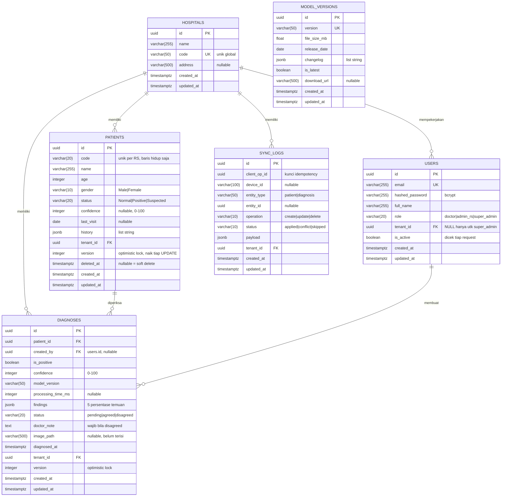

# Skema Basis Data — TBScreenAI

**Postgres 16** · migrasi Alembic: `1342b192e0cd` (skema awal) → `a1f4c7d92b30` (version counter + soft delete)

Enam tabel. Lima terikat tenant (rumah sakit), satu global.

---

## ERD



`MODEL_VERSIONS` sengaja berdiri sendiri tanpa relasi: katalog model AI bersifat global, semua rumah sakit menarik daftar yang sama lewat `/sync/model-version`.

---

## Keputusan desain yang perlu diketahui

### 1. Isolasi tenant ditegakkan di lapisan API, bukan RLS

Setiap tabel data medis membawa `tenant_id` (lihat `TenantMixin` di `app/models/base.py`). Handler **tidak pernah** membaca `tenant_id` dari body request — nilainya selalu diturunkan dari token pengguna di `app/api/deps.py`. Konsekuensinya: baris milik RS lain dijawab **404, bukan 403**, sehingga keberadaannya tidak terkonfirmasi.

Postgres Row-Level Security belum dipakai. Ini pilihan sadar untuk fase MVP, dan tercatat sebagai kandidat pengerasan berikutnya.

### 2. `diagnoses` membawa `tenant_id` sekaligus `patient_id`

Denormalisasi yang disengaja. Tanpa `tenant_id` langsung, setiap query diagnosis harus join ke `patients` hanya untuk memfilter tenant — dan satu join yang terlupa di satu endpoint saja sudah cukup untuk membocorkan data antar rumah sakit. Kolomnya redundan; jaminannya bukan.

### 3. `version` adalah sinyal konflik, bukan `updated_at`

Tablet menyimpan cache lewat drift, yang menyimpan `DateTime` sebagai **unix detik**. Artinya `base_updated_at` dari klien tidak pernah membawa informasi sub-detik, jadi dua penyuntingan dalam detik yang sama tidak bisa dibedakan — yang belakangan akan menimpa yang awal tanpa terdeteksi.

`version` naik otomatis tiap UPDATE (SQLAlchemy `version_id_col`). Klien mengirim balik versi yang ia sunting sebagai `base_version`; beda sedikit pun berarti konflik. SQLAlchemy juga menambahkan `WHERE version = :old` pada tiap UPDATE, jadi penulis bersamaan mendapat `StaleDataError` alih-alih memenangkan balapan.

Perbandingan `updated_at` masih ada sebagai fallback untuk klien lama, dengan batasan presisinya didokumentasikan di `app/services/sync.py`.

### 4. Pasien di-soft delete, dan kodenya bisa dipakai ulang

`deleted_at` non-NULL berarti terhapus. Dua alasan, dan yang kedua mudah terlewat: rekam klinis punya kewajiban retensi, **dan** DELETE keras atas pasien yang punya diagnosis melanggar foreign key — dulu muncul sebagai HTTP 500 untuk pasien mana pun yang pernah discreening.

Keunikan kode pasien karenanya jadi **partial unique index**:

```sql
CREATE UNIQUE INDEX uq_patient_tenant_code ON patients (tenant_id, code)
  WHERE deleted_at IS NULL;
```

Constraint UNIQUE biasa akan mengunci kode itu selamanya meski pasiennya sudah dihapus.

### 5. `UNIQUE (tenant_id, client_op_id)` adalah jantung sinkronisasi

Tablet offline **pasti** akan mengulang kiriman. Constraint ini yang membuat pengulangan dijawab `skipped` alih-alih menggandakan rekam medis. Kunci idempotency-nya dibuat di sisi klien, bukan server.

---

## Indeks

| Indeks | Tabel | Alasan |
|---|---|---|
| `uq_patient_tenant_code` | patients | Kode unik per RS, hanya baris hidup (partial) |
| `uq_synclog_tenant_op` | sync_logs | Kunci idempotency |
| `ix_patients_tenant_id` | patients | Setiap query difilter tenant |
| `ix_diagnoses_tenant_id` | diagnoses | Sama |
| `ix_diagnoses_patient_id` | diagnoses | Diagnosis per pasien |
| `ix_patients_updated_at` | patients | `/sync/pull` memfilter kolom ini |
| `ix_diagnoses_updated_at` | diagnoses | Sama |

---

## Bentuk `findings` (JSONB)

Lima persentase, 0–100, cerminan kontrak `ValidationFindings` di Flutter:

```json
{
  "consolidation": 26.3,
  "cavity": 0.6,
  "effusion": 5.6,
  "fibrotic": 0.0,
  "calcification": 0.0
}
```

Divalidasi oleh Pydantic (`Findings`), bukan oleh basis data. Postgres hanya menjamin ini JSON yang sah.

---

## Yang BELUM ada di skema ini

Jujur dicatat supaya tidak dikira sudah selesai:

- **`image_path` selalu NULL.** Citra X-ray belum disimpan di mana pun; penyimpanan objek (rencana: MinIO) belum dikerjakan.
- **Tidak ada tabel audit akses.** `sync_logs` mencatat operasi sinkronisasi, bukan siapa membaca atau mengubah apa lewat REST. Regulasi rekam medis menuntut jejak itu.
- **Tidak ada tabel refresh token / denylist.** Logout hanya membuang token di sisi klien; token curian tetap sah sampai kedaluwarsa (7 hari).
- **Peran disimpan sebagai string**, bukan enum basis data. Divalidasi di lapisan skema saja.
- **Tidak ada CHECK constraint** untuk `status`, `gender`, atau `role` — semuanya dijaga Pydantic.
